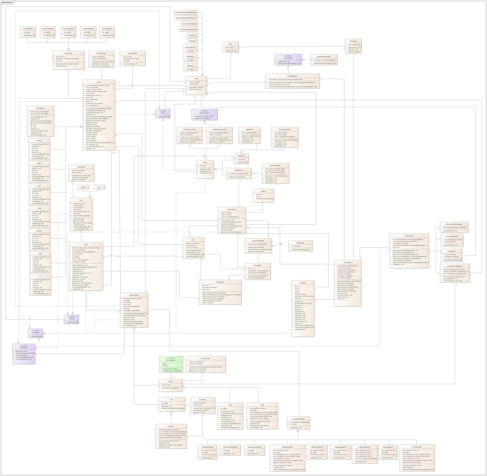

<h1 style="color: red; text-decoration: underline;"><strong>B6B36OMO -- Objektové modelování</strong></h1>
<h2 style="color: red; text-decoration: underline;">Semestrální práce</h2>
<h2 style="color: red; text-decoration: underline;">Smart Home</h2>
<h6>Autoři: 
<a href="https://gitlab.fel.cvut.cz/paspoiva/">Pasportnikov Ivan</a>, 
<a href="https://gitlab.fel.cvut.cz/mashkvla/">Mashkin Vladimir</a>
</h6>
<h1><a href="https://gitlab.fel.cvut.cz/paspoiva/b231_b6b36omo-semestralka/-/blob/main/DESCRIPTION.pdf">DESCRIPTION</a></h1>
<h2 style="color: red; text-decoration: underline;">UML Class Diagram</h2>

<h2 style="color: red; text-decoration: underline;">Use Case Diagram</h2>

